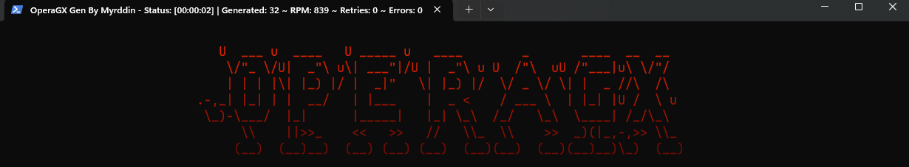

    

  PoC program to generate nitro promo links using operagx.

    
  

## How can you use it?

You can either download the ready-to-use release or you can download the source and compile it by yourself. I highly recommend using proxies if you want to gen a big number of promo links, because your ip gonna be banned.

## Can i skid it?

No.